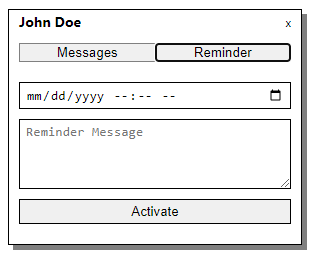

## LinkedIn Messaging Reminders 

### Chrome plugin
---------

Set up LinkedIn Messaging Reminders on Chrome:
1. Activate the "LinkedIn Messaging Reminders" Chrome plugin. A popup will appear with a slider and sidebar icon. By default, the slider is disabled.
2. Go to LinkedIn and log in to your account. You should see the Messaging window on the bottom right of the screen.
3. Click on the plugin and enable the slider in the popup.
4. In the LinkedIn messaging window, click on a Message you would like the reminder to be set up for.
5. Now, click on the "LinkedIn Messaging Reminders" plugin popup window and click on the Sidebar icon. You will see the person's name under the title.
6. If you click on "Messages" for this person, you will see the collected messages from the conversation.
7. To schedule a reminder, click on "Reminder". It will open a form with a Date input field, text area and "Activate" button.
8. Add a date and time for when this reminder should be triggered and text for the reminder's body. Both are required.
9. Click the "Activate" button to activate the reminder.

The above steps create a reminder that will be shown at the chosen date and time.
> Multiple reminders can be activated at the same time. You have to follow the steps above to set up more reminders.

-------

